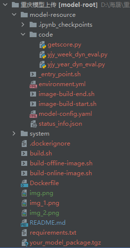
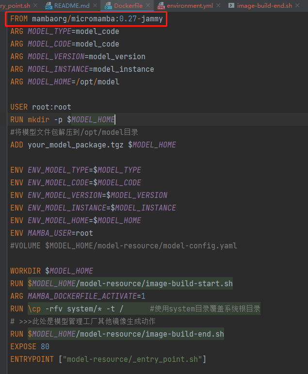
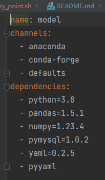
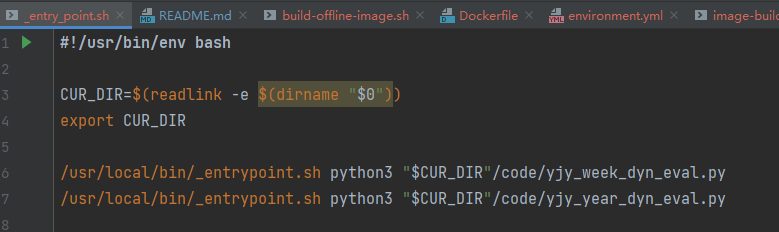

<h1>模型工厂配置流程</h1>
<h2>前言： </h2>
重庆烟叶数字化转型模式探索与实践项目，将建设9个AI模型及1个模型管理工厂。
其中9个模型由4个不同的承建单位，共计3年时间里完成。项目计划通过模型管理工厂，对模型和模型应用实现管理。

<h2>背景</h2>

<h2>项目文件</h2>

<h3>项目文件主要有model_resource 和 system: </h3>
model_resource: 模型资源目录 
&nbsp;&nbsp;&nbsp;&nbsp;&nbsp;&nbsp; _entry_point.sh &nbsp;&nbsp;#镜像启动入口
 
&nbsp;&nbsp;&nbsp;&nbsp;&nbsp;&nbsp; image-build-end.sh &nbsp;&nbsp;#镜像制作结束脚本
 
&nbsp;&nbsp;&nbsp;&nbsp;&nbsp;&nbsp; image-build-start.sh &nbsp;&nbsp;#镜像制作开始脚本
 
&nbsp;&nbsp;&nbsp;&nbsp;&nbsp;&nbsp; model-config.yaml 
&nbsp;&nbsp;&nbsp;&nbsp;&nbsp;&nbsp; /code/  存放项目代码
 
system：系统资源目录用于覆盖系统配置 
&nbsp;&nbsp;&nbsp;&nbsp;&nbsp;&nbsp; etc &nbsp; #例子:etc目录 
&nbsp;&nbsp;&nbsp;&nbsp;&nbsp;&nbsp;&nbsp;&nbsp;&nbsp;&nbsp;&nbsp;&nbsp;hosts  &nbsp;&nbsp;#例子：hosts文件

<h3>配置步骤</h3>
由于我们使用了<a href = "https://mamba.readthedocs.io/en/latest/user_guide/micromamba.html"><b><i>micromamba</b></i></a>镜像（在Dockerfile中需要将基础镜像设置为&nbsp;<b>FROM mambaorg/micromamba:0.27-jammy</b>）

<h2>修改<b>image-build-start.sh</b>文件</h2>
<h3>1.我们需要将root用户更改为mamba以绕过其中的检测</h4>

echo "root" > "/etc/arg_mamba_user" 
export MAMBA_USER=root 
export USER="root" 
export HOME="/root" 

cat <<< $(readlink -e ~) 

cat > /usr/local/bin/_entrypoint.sh <<-EOF
 #!/usr/bin/env bash 
set -ef -o pipefail 

export USER=$USER 
export HOME=$HOME 

source _activate_current_env.sh 

exec "\$@" 
EOF 

<h3>2.添加镜像源来增加速度</h3>

cat > /root/.condarc <<-EOF 
channels: 
  - defaults 
show_channel_urls: true 
default_channels: 
&nbsp;&nbsp;- http://mirrors.aliyun.com/anaconda/pkgs/main 
&nbsp;&nbsp;- http://mirrors.aliyun.com/anaconda/pkgs/r 
&nbsp;&nbsp;- http://mirrors.aliyun.com/anaconda/pkgs/msys2 
&nbsp;&nbsp;- https://mirrors.tuna.tsinghua.edu.cn/anaconda/pkgs/main 
&nbsp;&nbsp;- https://mirrors.tuna.tsinghua.edu.cn/anaconda/pkgs/free 
&nbsp;&nbsp;- https://mirrors.tuna.tsinghua.edu.cn/anaconda/pkgs/r 
&nbsp;&nbsp;- https://mirrors.tuna.tsinghua.edu.cn/anaconda/pkgs/pro 
&nbsp;&nbsp;- https://mirrors.tuna.tsinghua.edu.cn/anaconda/pkgs/msys2 

custom_channels: 
&nbsp;&nbsp;conda-forge: http://mirrors.aliyun.com/anaconda/cloud  
&nbsp;&nbsp;msys2: http://mirrors.aliyun.com/anaconda/cloud  
&nbsp;&nbsp;bioconda: http://mirrors.aliyun.com/anaconda/cloud  
&nbsp;&nbsp;menpo: http://mirrors.aliyun.com/anaconda/cloud  
&nbsp;&nbsp;pytorch: http://mirrors.aliyun.com/anaconda/cloud  
&nbsp;&nbsp;simpleitk: http://mirrors.aliyun.com/anaconda/cloud  
EOF 

<h3>3.通过micromamba来安装需要的包</h3>(需要在model-resource下的environment.yml文件中说明需要使用的包) 

<h3>随手执行语句即可完成包的安装 </h3>
micromamba clean -i 

micromamba install -y -n base -f model-resource/environment.yml && \  
&nbsp;&nbsp;&nbsp;&nbsp;micromamba clean --all --yes 

<h3>现在我们就可以配置_entry_point.sh文件来说明需要启动的程序</h3>

<h2>通过docker来构建镜像</h2>